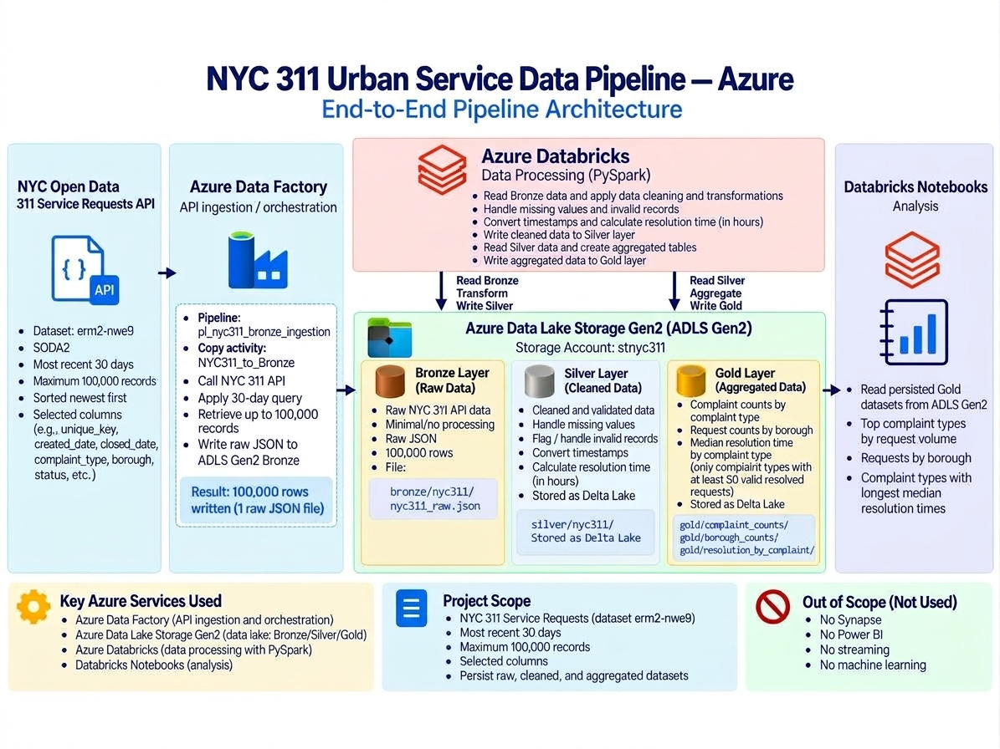

# NYC 311 Urban Service Data Pipeline — Azure

An end-to-end Azure data engineering project that ingests NYC 311 Service Requests data, stores it in a Bronze/Silver/Gold data lake architecture, transforms it with Azure Databricks and PySpark, and produces Gold datasets for analyzing complaint volume, borough activity, and resolution times.

## Project Questions

This project was built to answer three practical questions from NYC 311 service request data:

1. Which complaint types generate the most requests?
2. Which boroughs generate the most requests?
3. Which complaint categories take the longest to resolve?

## Architecture



The implemented data flow is:

**NYC Open Data 311 API → Azure Data Factory → ADLS Gen2 Bronze → Azure Databricks / PySpark → ADLS Gen2 Silver → Azure Databricks / PySpark → ADLS Gen2 Gold → Databricks Notebook Analysis**

Bronze, Silver, and Gold are logical data layers stored in the same Azure Data Lake Storage Gen2 account, while Azure Databricks provides the compute and processing layer.

<br>

## Key Findings

### Top 5 Complaint Types by Request Count

1. Illegal Parking — 16,102
2. Noise - Residential — 10,755
3. Blocked Driveway — 5,118
4. UNSANITARY CONDITION — 4,433
5. Noise - Street/Sidewalk — 4,220

### Requests by Borough

- Brooklyn — 32,447
- Queens — 25,376
- Manhattan — 19,881
- Bronx — 18,076
- Staten Island — 4,071
- Unspecified — 149

### Highest Median Resolution Times

Minimum 50 valid resolved requests per complaint type.

1. Lost Property — 112.85 hours
2. APPLIANCE — 100.99 hours
3. UNSANITARY CONDITION — 92.01 hours
4. DOOR/WINDOW — 88.42 hours
5. GENERAL — 87.61 hours
6. Rodent — 87.44 hours
7. FLOORING/STAIRS — 86.77 hours
8. WATER LEAK — 80.44 hours
9. SAFETY — 75.76 hours
10. PAINT/PLASTER — 74.66 hours

<br>

## Technologies Used

- **Azure Data Factory** — ingested NYC 311 API data into the data lake
- **Azure Data Lake Storage Gen2** — stored Bronze, Silver, and Gold data layers
- **Azure Databricks** — provided the processing and notebook environment
- **PySpark** — cleaned, transformed, and aggregated the data
- **Delta Lake** — stored the Silver and Gold datasets
- **NYC Open Data API** — provided the source 311 Service Requests data

<br>

## Data Source and Ingestion

The project uses the **NYC Open Data 311 Service Requests API** (`erm2-nwe9`) through the SODA2 API.

The ingestion was scoped to:

- a 30-day snapshot of NYC 311 requests from August 30 through September 29, 2026
- a maximum of 100,000 records
- selected fields relevant to complaint, location, status, and resolution analysis

Azure Data Factory ingested the API data into the Bronze layer in ADLS Gen2.

<br>

**Ingestion result:**

- 100,000 objects read
- 100,000 rows written
- 1 raw JSON file created

Bronze path:

`bronze/nyc311/nyc311_raw.json`

<br>

## Bronze Validation and Silver Processing

Before transforming the raw data, the Bronze layer was validated for row count, uniqueness, and missing values.

**Bronze validation results:**

- 100,000 total rows
- 100,000 unique `unique_key` values
- 0 duplicate `unique_key` values
- 25,046 missing `closed_date` values
- 1,062 missing `incident_zip` values
- 7,183 missing `location_type` values

The Silver layer was then created in Azure Databricks using PySpark.

Key transformations included:

- converting `created_date` and `closed_date` to timestamps
- trimming text fields
- standardizing borough values
- calculating `resolution_seconds` and `resolution_hours`
- creating a `resolution_time_flag`
- retaining open requests with null resolution time
- handling negative resolution-time anomalies with quality flags
- storing the cleaned dataset as Delta Lake

Silver path:

`silver/nyc311/`

---

### Resolution-Time Data Quality

The Silver layer preserved all 100,000 records while assigning quality flags to resolution-time values.

**Resolution-time results:**

- `VALID` — 74,893
- `ADJUSTED_TO_ZERO` — 58
- `OPEN_OR_UNCLOSED` — 25,046
- `INVALID_NEGATIVE` — 3

Cleaning rules:

- valid positive duration → calculate normally
- negative duration ≤ 60 seconds → normalize resolution time to 0
- negative duration > 60 seconds → retain the row, set resolution time to null, and flag as `INVALID_NEGATIVE`
- missing `closed_date` → retain the row, set resolution time to null, and flag as `OPEN_OR_UNCLOSED`

No invalid rows were deleted; they were retained and quality-flagged.

<br>

## Gold Processing

The Silver dataset was transformed into three persisted Gold Delta datasets for analysis:

- `gold/complaint_counts/` — request counts grouped by `complaint_type`
- `gold/borough_counts/` — request counts grouped by `borough`
- `gold/resolution_by_complaint/` — median resolution hours grouped by complaint type

For resolution-time analysis:

- only `VALID` resolved requests were used
- 74,893 valid resolved rows were included
- median resolution time was used instead of mean because the data was strongly right-skewed
- complaint types required at least 50 valid resolved requests to be included

The 50-request threshold applies only to `resolution_by_complaint`, not to the complaint-count or borough-count datasets.

<br>

## Notebooks

The project is organized into three Databricks notebooks:

- [`01_bronze_to_silver.ipynb`](notebooks/01_bronze_to_silver.ipynb) — validates Bronze data, cleans and transforms the dataset, and writes the Silver Delta table
- [`02_silver_to_gold.ipynb`](notebooks/02_silver_to_gold.ipynb) — reads the Silver dataset and creates the persisted Gold aggregations
- [`03_gold_analysis.ipynb`](notebooks/03_gold_analysis.ipynb) — reads the Gold datasets and presents the final complaint, borough, and resolution-time analysis

<br>

## Project Screenshots

Selected screenshots are included to document the completed pipeline and its outputs.

- [Azure project resources](screenshots/01_azure_resources.png)
- [Raw Bronze JSON file in ADLS Gen2](screenshots/02_adls_bronze_raw_file.png)
- [Azure Data Factory ingestion pipeline](screenshots/03_adf_pipeline_design.png)
- [Successful ingestion of 100,000 rows](screenshots/04_adf_ingestion_success_100k_rows.png)
- [Bronze, Silver, and Gold containers](screenshots/05_adls_bronze_silver_gold_containers.png)
- [Bronze validation in Databricks](screenshots/06_databricks_bronze_validation.png)
- [Silver Delta Lake storage](screenshots/07_silver_delta_lake_storage.png)
- [Gold complaint-count Delta dataset](screenshots/08_gold_complaint_counts_delta.png)
- [Persisted Gold datasets](screenshots/09_gold_datasets.png)
- [Median resolution-time analysis](screenshots/10_gold_median_resolution_analysis.png)
- [Complaint and borough analysis](screenshots/11_gold_complaints_and_borough_analysis.png)

<br>

## Repository Structure

```text
nyc311-azure-data-pipeline/
├── architecture/
│   └── nyc311_azure_architecture.jpg
├── notebooks/
│   ├── 01_bronze_to_silver.ipynb
│   ├── 02_silver_to_gold.ipynb
│   └── 03_gold_analysis.ipynb
├── screenshots/
│   ├── 01_azure_resources.png
│   ├── 02_adls_bronze_raw_file.png
│   ├── 03_adf_pipeline_design.png
│   ├── 04_adf_ingestion_success_100k_rows.png
│   ├── 05_adls_bronze_silver_gold_containers.png
│   ├── 06_databricks_bronze_validation.png
│   ├── 07_silver_delta_lake_storage.png
│   ├── 08_gold_complaint_counts_delta.png
│   ├── 09_gold_datasets.png
│   ├── 10_gold_median_resolution_analysis.png
│   └── 11_gold_complaints_and_borough_analysis.png
└── README.md
```

<br>

## Reproducing the Pipeline

At a high level, the project can be reproduced by:

1. Creating an ADLS Gen2 storage account with `bronze`, `silver`, and `gold` containers.
2. Using Azure Data Factory to ingest NYC 311 Service Requests data from the SODA2 API (`erm2-nwe9`) into the Bronze layer.
3. Connecting Azure Databricks to ADLS Gen2.
4. Running `01_bronze_to_silver.ipynb` to validate, clean, and write the Silver Delta dataset.
5. Running `02_silver_to_gold.ipynb` to create the three Gold Delta datasets.
6. Running `03_gold_analysis.ipynb` to analyze the persisted Gold datasets.

Credentials, secrets, and environment-specific authentication values are intentionally not included in this repository.

<br>

## Limitations

This project was intentionally scoped as a focused V1 data engineering portfolio project.

Current limitations include:

- the source data is limited to a 30-day snapshot from August 30 through September 29, 2026
- ingestion is capped at 100,000 records
- the pipeline uses one NYC 311 dataset
- the project is batch-based rather than streaming
- analysis is performed in Databricks notebooks rather than a BI dashboard
- Synapse, Power BI, CI/CD, machine learning, and streaming were intentionally excluded from V1
